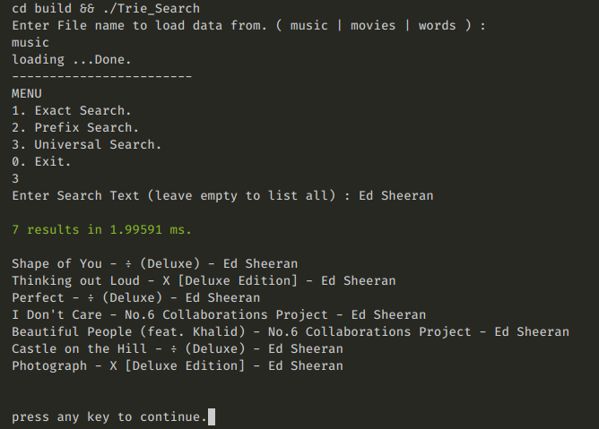
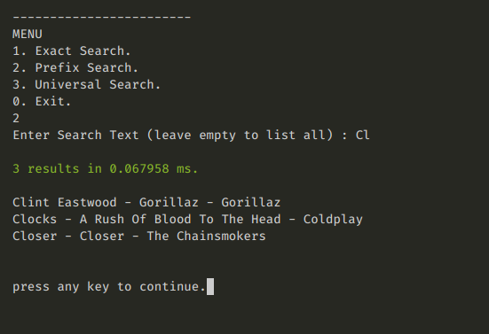

# Trie Search
A little Search Engine implementation using Trie Data Structure.

[*See Documentation*](https://rohitkaushal7.github.io/trie-search)

### scripts
- make
    Compiles and runs the project.
- make cmp
    Compiles the code.
- make run
    Runs the already build code without compiling.

---

---
#  Trie
In computer science, a trie, also called digital tree or prefix tree, is a kind of search tree—an ordered tree data structure used to store a dynamic set or associative array where the keys are usually strings.

Unlike a binary search tree, no node in the tree stores the key associated with that node; instead, its position in the tree defines the key with which it is associated; i.e., the value of the key is distributed across the structure. All the descendants of a node have a common prefix of the string associated with that node, and the root is associated with the empty string. Keys tend to be associated with leaves, though some inner nodes may correspond to keys of interest. Hence, keys are not necessarily associated with every node. For the space-optimized presentation of prefix tree, see compact prefix tree.

# Applications

- Looking up data in a trie is faster in the worst case, O(m) time (where m is the length of a search string), compared to an imperfect hash table. An imperfect hash table can have key collisions. A key collision is the hash function mapping of different keys to the same position in a hash table. The worst-case lookup speed in an imperfect hash table is O(N) time, but far more typically is O(1), with O(m) time spent evaluating the hash.
- There are no collisions of different keys in a trie.
- There is no need to provide a hash function or to change hash functions as more keys are added to a trie.
- A trie can provide an alphabetical ordering of the entries by key.

**Complexities**
> Insert : O(m)    : m is the length of string.  
> Delete : O(m)    : m is the length of string.  
> Search : O(m)    : m is the length of string.  
>
> Space Complexity : O(n*m)     :  n = number of string , m = avg length of strings

# Run the project (linux)
- in the root directory of the project run 
    - `make` : it will compile the project and produce the executable in `build/Trie_Search`
    - data files are stored in `data/` directory which consist of string units each in different line.
        - you can store custom strings in words.txt or add a custom file in data/ directory.
- execute the executable directly. OR `make run` in the root directory.
    - choose the file to load in trie data structure.
    - search for keywords.

## Run the project (win)
- Compile the file `src/main.cpp` in windows to produce the executable and then run the executable.

# Example
### Universal Search

### Prefix Search 
